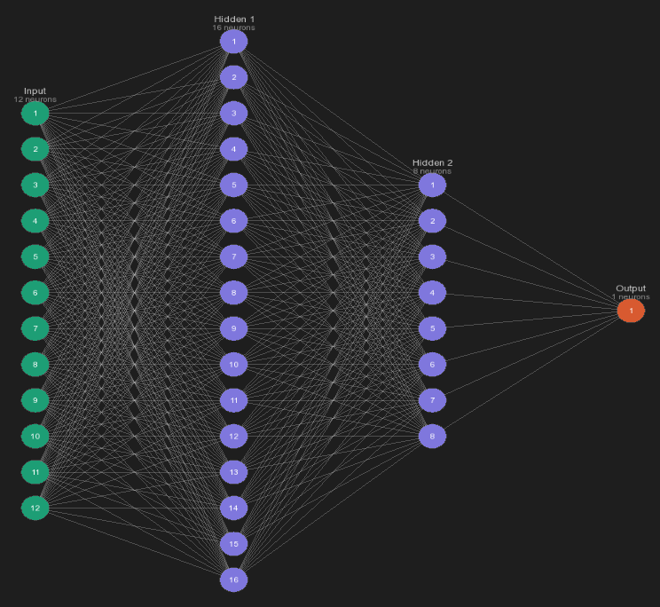
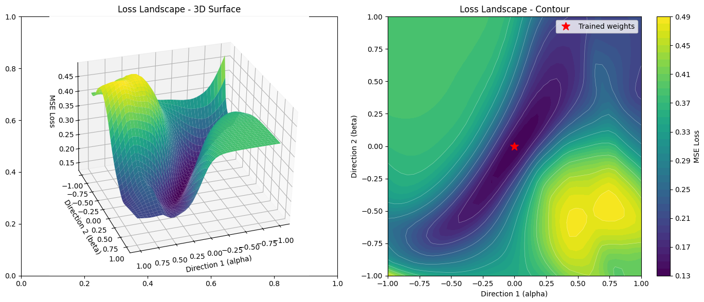

# Neural Network from Scratch

An educational project to understand how neural networks work by building one from scratch in C++, without any ML libraries.

Tested on the Kaggle Titanic competition, scoring in the top 10% with a score of 0.79186 out of more than 12,000 competitors.



## Installation

**Prerequisites:** [vcpkg](https://github.com/microsoft/vcpkg), CMake, a C++20 compiler.

Install dependencies:

```bash
vcpkg install sfml curl nlohmann-json
```

Build:

```bash
cmake -B build -DCMAKE_TOOLCHAIN_FILE=/path/to/vcpkg/scripts/buildsystems/vcpkg.cmake
cmake --build build
```


## Resources

- 3Blue1Brown neural networks course (https://www.youtube.com/playlist?list=PLZHQObOWTQDNU6R1_67000Dx_ZCJB-3pi)
- GreenCode NN from scratch in Python explanation video (https://youtu.be/cAkMcPfY_Ns?si=Cadj_Bu53qZcmKBK)